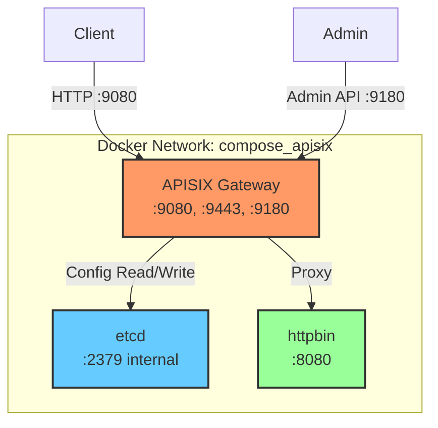

# Apache APISIX Local Environment Setup - Walkthrough

## Summary

Apache APISIX 3.14.1 (최신 릴리즈)을 로컬 Docker 환경에서 성공적으로 구축하였습니다.

## Changes Made

### 1. Git Checkout

최신 릴리즈 태그로 체크아웃:

```bash
git checkout 3.14.1
```

---

### 2. Docker Compose 수정

#### [docker-compose-master.yaml](file:///home/dhs-shine/Workspace/LLMOps/apisix/docker/compose/docker-compose-master.yaml)

render_diffs(file:///home/dhs-shine/Workspace/LLMOps/apisix/docker/compose/docker-compose-master.yaml)

**변경 사항:**
- `version` 속성 제거 (deprecated)
- etcd 외부 포트 바인딩 제거 (포트 충돌 방지)
- 기본 APISIX 이미지 태그를 `3.14.1-debian`으로 설정

---

## Verification Results

### 서비스 상태

```
NAME                IMAGE                          STATUS          PORTS
compose-apisix-1    apache/apisix:3.14.1-debian    Up              9080, 9091, 9180, 9443
compose-etcd-1      bitnamilegacy/etcd:3.6         Up              2379-2380 (internal)
compose-httpbin-1   ghcr.io/mccutchen/go-httpbin   Up              8280->8080
```

### Admin API 테스트

```bash
curl http://127.0.0.1:9180/apisix/admin/routes \
  -H 'X-API-KEY: edd1c9f034335f136f87ad84b625c8f1'
```

**Result:** ✅ `{"list":[],"total":0}`

### 프록시 테스트

테스트 Route 생성:
```bash
curl -X PUT http://127.0.0.1:9180/apisix/admin/routes/1 \
  -H 'X-API-KEY: edd1c9f034335f136f87ad84b625c8f1' \
  -H 'Content-Type: application/json' \
  -d '{
    "uri": "/get",
    "upstream": {
      "type": "roundrobin",
      "nodes": {"httpbin:8080": 1}
    }
  }'
```

프록시 요청:
```bash
curl http://127.0.0.1:9080/get
```

**Result:** ✅ 

```
HTTP/1.1 200 OK
Server: APISIX/3.14.1
{
  "headers": {
    "X-Forwarded-For": ["172.18.0.1"],
    "X-Forwarded-Proto": ["http"]
  },
  "method": "GET",
  "url": "http://127.0.0.1:9080/get"
}
```

---

## Port Mapping

| Port | Service | Description |
|------|---------|-------------|
| `9080` | APISIX | HTTP Proxy |
| `9443` | APISIX | HTTPS Proxy |
| `9180` | APISIX | Admin API |
| `9091` | APISIX | Prometheus Metrics |
| `8280` | httpbin | 테스트 백엔드 (선택적) |

---

## Useful Commands

```bash
# 서비스 시작
cd /home/dhs-shine/Workspace/LLMOps/apisix/docker/compose
docker compose -f docker-compose-master.yaml up -d

# 서비스 상태 확인
docker compose -f docker-compose-master.yaml ps

# 로그 확인
docker compose -f docker-compose-master.yaml logs -f apisix

# 서비스 중지
docker compose -f docker-compose-master.yaml down

# APISIX 설정 리로드
docker exec compose-apisix-1 apisix reload
```

---

## Architecture



---

## Notes

> [!NOTE]
> httpbin 서비스는 프록시 테스트용으로 포함되어 있습니다. 필요하지 않다면 `docker-compose-master.yaml`에서 해당 서비스를 제거할 수 있습니다.

> [!TIP]
> Admin API Key는 `edd1c9f034335f136f87ad84b625c8f1`입니다. 프로덕션 환경에서는 반드시 변경하세요.
