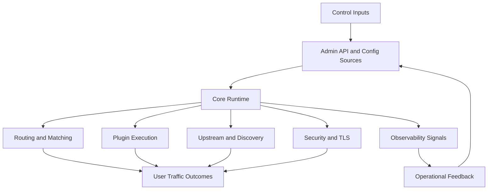

# APISIX 연구 아키텍처 개요

## 한 줄 요약

Apache APISIX는 OpenResty 위에서 동작하는 동적 API 게이트웨이이며, 핵심 런타임, 플러그인 계층, 배포 모드, 운영 API, 테스트 하네스를 통해 에이전트 우선 분석에 적합한 비교적 선명한 구조를 가진다.

## 연구 관점의 시스템 분해

## 핵심 관찰

### 1. 런타임 진입점이 명확하다

- `apisix/init.lua`는 초기화, worker 초기화, SSL phase, 라우팅 및 플러그인 부팅 순서를 드러낸다.
- 이 구조는 에이전트가 시스템의 제어 흐름을 파악하기 쉬운 편이다.

### 2. 플러그인 시스템이 플랫폼 확장의 중심이다

- `apisix/plugin.lua`는 플러그인 로딩, 정렬, 메타 스키마 주입, HTTP와 stream 서브시스템 분리를 보여 준다.
- APISIX의 기능 대부분은 코어가 아닌 플러그인 계층에 수렴한다.

### 3. 배포 모델이 명시적으로 문서화되어 있다

- traditional, decoupled, standalone이 공식 문서로 정리되어 있어 운영 전략을 분석하기 좋다.
- 특히 standalone API-driven 모드는 에이전트 자동화 워크플로와 접점이 크다.

### 4. 테스트와 운영 신호가 저장소 내부에 풍부하다

- `t/` 하위의 Test::Nginx 기반 테스트는 실행 가능한 시스템 행위를 문서화한다.
- `ci/`와 `Makefile`은 유지보수 규율과 품질 게이트를 드러낸다.

## 세부 소스코드 검토

### 부트스트랩과 worker 생명주기

`apisix/init.lua`를 기준으로 보면 APISIX는 단일 엔트리포인트에서 모든 핵심 서브시스템을 순차적으로 붙인다.

- `http_init` 단계에서 resolver, id, env, privileged agent, config center 초기화를 수행한다.
- `http_init_worker` 단계에서 events, lrucache, discovery, balancer, admin, timers, debug, plugin, router, service, consumer, secret, global rules, upstream, ext-plugin, control router를 차례대로 기동한다.
- 이 순서는 단순 나열이 아니라 의존성 순서다. 예를 들어 라우터는 config watcher가 준비된 뒤 의미가 있고, Prometheus 초기화는 관련 worker가 살아난 뒤 호출된다.

이 구조는 agent-first 분석에서 매우 중요하다. 에이전트는 기능 파일 하나를 읽는 것보다 초기화 순서를 보면 런타임의 실제 결합 관계를 더 빨리 이해할 수 있다.

### 라우팅 빌드와 매칭의 실제 흐름

`apisix/router.lua`와 `apisix/http/route.lua`, `apisix/http/router/radixtree_uri.lua`를 함께 보면 라우팅은 다음 흐름으로 작동한다.

1. worker 초기화 시 현재 설정의 HTTP 라우터 종류를 읽는다.
2. `/routes` config watcher를 통해 route 집합을 동기화한다.
3. 각 route는 `filter` 과정에서 host 정규화와 upstream 정리를 거친다.
4. radixtree 구조를 빌드해 URI, method, host, remote_addr, vars 조건을 포함한 dispatch 테이블을 만든다.
5. 요청 시 `dispatch`가 `api_ctx`에 `matched_route`와 `matched_params`를 기록한다.

특히 주목할 점은 route 빌드가 단순 경로 인덱싱이 아니라 서비스 연계, `filter_func`, `vars` expression 검증, plugin checker까지 포함한 정제 파이프라인이라는 점이다. 따라서 APISIX의 route는 단순 proxy rule이 아니라 정책 객체에 가깝다.

### upstream 해석과 health check 결합

`apisix/upstream.lua`는 요청이 어느 upstream으로 가는지를 정하는 것 이상을 수행한다.

- route 또는 service에서 선택된 upstream을 `api_ctx`에 버전화된 키로 저장한다.
- service discovery가 설정된 경우 discovery provider를 호출해 동적으로 node 목록을 갱신한다.
- port가 생략된 node는 scheme 기준으로 보정한다.
- stream과 HTTP 모드에 따라 서로 다른 TLS 처리 분기를 가진다.
- healthcheck manager에서 checker를 가져와 `api_ctx.up_checker`에 연결한다.

즉 upstream은 정적 config blob가 아니라 discovery, TLS, healthcheck, runtime cache가 합쳐진 런타임 객체다. 이 때문에 에이전트가 장애 원인을 찾을 때 route만 보고 끝내면 안 되고 upstream 재해석 경로를 함께 봐야 한다.

### Admin API는 리소스 라우터다

`apisix/admin/init.lua`는 Admin API를 단일 핸들러가 관리하지만 내부적으로는 리소스 타입별 모듈로 위임한다.

- 토큰 검증에서 `viewer`와 `admin` 역할을 분리한다.
- URI segment를 분해해 `routes`, `services`, `upstreams`, `consumers`, `plugin_metadata`, `stream_routes` 등 리소스로 라우팅한다.
- JSON request body를 디코드하고 `ttl` 같은 query 인자를 검증한다.
- 결과는 v2 혹은 v3 adapter를 통해 필터링되고, etcd 내부 메타데이터는 응답에서 제거된다.

이 설계는 사람이 보기에도 명확하지만 에이전트에게 특히 유리하다. 리소스 중심이기 때문에 `resource x method` 조합으로 행동을 추론할 수 있고, Admin API 테스트는 곧 리소스 CRUD의 행위 사양이 된다.

## 행위 기반 시나리오 요약

### 시나리오 A: route 생성

`t/admin/routes.t` 기준으로 route 생성은 단순 PUT 요청이 아니라 다음 보장을 포함한다.

- request body 스키마가 route 리소스 규칙을 만족해야 한다.
- etcd 키는 `/apisix/routes/<id>` 아래에 기록된다.
- 생성 후 GET으로 동일 구조를 재조회할 수 있어야 한다.
- POST로 자동 생성된 route도 create_time과 update_time이 저장된다.

이 테스트는 문서가 설명하지 않는 운영 사실도 드러낸다. 예를 들어 APISIX는 리소스 생성 시 시간을 메타데이터로 남기며, 테스트는 이를 불변 조건으로 간주한다.

### 시나리오 B: standalone config API

`t/admin/standalone.spec.ts`를 보면 standalone API-driven 모드는 문서 설명보다 더 구체적인 행위를 가진다.

- 초기 상태에서는 resource별 conf_version이 0이다.
- PUT 갱신 시 digest가 다르면 202를 반환하고 `x-last-modified`, `x-digest`를 기록한다.
- 동일 digest 재전송은 204로 short-circuit된다.
- HEAD 요청은 전체 body 없이 메타데이터만 확인하는 운영 경로다.

이는 곧 APISIX가 standalone 모드에서 단순 파일 리로더가 아니라 버전과 digest를 가진 구성 저장소처럼 동작함을 의미한다.

## 에이전트 우선 관점에서 본 주요 레이어

| 레이어 | 역할 | 에이전트 가독성 | 연구 메모 |
| --- | --- | --- | --- |
| Entry and bootstrap | 프로세스 초기화와 worker 생명주기 | 높음 | 중앙 진입점이 분명함 |
| Routing | Route, SNI, URI 매칭 | 중간 | 파일 분산도가 다소 있음 |
| Plugin orchestration | 기능 확장과 phase 실행 | 높음 | 규칙성 있는 구조 |
| Config and deployment | Admin API, etcd, standalone | 높음 | 공식 문서 품질이 높음 |
| Testing | 회귀 방지와 시나리오 검증 | 높음 | 테스트 파일이 사실상 실행 사양 |
| Observability | 로그, 메트릭, trace | 중간 이상 | 기능은 풍부하지만 탐색 경로는 다층적 |

## 아키텍처 강점

- 코어와 플러그인 역할 분리가 비교적 명확하다.
- 운영 시나리오가 문서와 설정 예제로 연결된다.
- 테스트 자산이 넓고 실제 동작을 반영한다.
- AI Gateway, MCP bridge, observability 같은 최신 기능 축이 추가되고 있다.

## 아키텍처 제약

- 저장소 규모가 커서 신규 에이전트가 전체 맥락을 한 번에 확보하기 어렵다.
- Lua 런타임, Nginx phase, 외부 플러그인 러너, stream 서브시스템까지 포함해 추론 공간이 넓다.
- 지식이 `README.md`, 공식 docs, 테스트, 설정 예제에 분산되어 있다.

## 연구 결론

APISIX는 이미 에이전트가 활용할 수 있는 구조적 힌트를 많이 갖고 있다. 다만 원문에서 제시된 agent-first 방식처럼 더 높은 자율성을 얻으려면 현재의 풍부한 문서와 테스트를 검색 가능한 연구 지식으로 재배열하는 작업이 중요하다.

가장 중요한 통찰은 다음과 같다.

- 실제 동작의 중심은 `README`보다 bootstrap과 test 파일에 더 선명하게 드러난다.
- Admin API, route matching, upstream resolution, standalone config API는 모두 리소스 중심 상태기계로 해석할 수 있다.
- APISIX는 agent-readable한 코드가 적지 않지만, 그 가독성은 파일 하나가 아니라 여러 파일을 횡단해서 읽을 때 비로소 드러난다.
