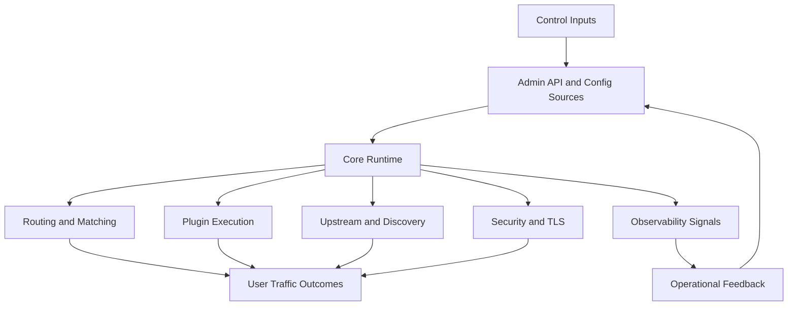

# APISIX 연구 아키텍처 개요

## 한 줄 요약

Apache APISIX는 OpenResty 위에서 동작하는 동적 API 게이트웨이이며, 핵심 런타임, 플러그인 계층, 배포 모드, 운영 API, 테스트 하네스를 통해 에이전트 우선 분석에 적합한 비교적 선명한 구조를 가진다.

## 연구 관점의 시스템 분해

## 핵심 관찰

### 1. 런타임 진입점이 명확하다

- `apisix/init.lua`는 초기화, worker 초기화, SSL phase, 라우팅 및 플러그인 부팅 순서를 드러낸다.
- 이 구조는 에이전트가 시스템의 제어 흐름을 파악하기 쉬운 편이다.

### 2. 플러그인 시스템이 플랫폼 확장의 중심이다

- `apisix/plugin.lua`는 플러그인 로딩, 정렬, 메타 스키마 주입, HTTP와 stream 서브시스템 분리를 보여 준다.
- APISIX의 기능 대부분은 코어가 아닌 플러그인 계층에 수렴한다.

### 3. 배포 모델이 명시적으로 문서화되어 있다

- traditional, decoupled, standalone이 공식 문서로 정리되어 있어 운영 전략을 분석하기 좋다.
- 특히 standalone API-driven 모드는 에이전트 자동화 워크플로와 접점이 크다.

### 4. 테스트와 운영 신호가 저장소 내부에 풍부하다

- `t/` 하위의 Test::Nginx 기반 테스트는 실행 가능한 시스템 행위를 문서화한다.
- `ci/`와 `Makefile`은 유지보수 규율과 품질 게이트를 드러낸다.

## 에이전트 우선 관점에서 본 주요 레이어

| 레이어 | 역할 | 에이전트 가독성 | 연구 메모 |
| --- | --- | --- | --- |
| Entry and bootstrap | 프로세스 초기화와 worker 생명주기 | 높음 | 중앙 진입점이 분명함 |
| Routing | Route, SNI, URI 매칭 | 중간 | 파일 분산도가 다소 있음 |
| Plugin orchestration | 기능 확장과 phase 실행 | 높음 | 규칙성 있는 구조 |
| Config and deployment | Admin API, etcd, standalone | 높음 | 공식 문서 품질이 높음 |
| Testing | 회귀 방지와 시나리오 검증 | 높음 | 테스트 파일이 사실상 실행 사양 |
| Observability | 로그, 메트릭, trace | 중간 이상 | 기능은 풍부하지만 탐색 경로는 다층적 |

## 아키텍처 강점

- 코어와 플러그인 역할 분리가 비교적 명확하다.
- 운영 시나리오가 문서와 설정 예제로 연결된다.
- 테스트 자산이 넓고 실제 동작을 반영한다.
- AI Gateway, MCP bridge, observability 같은 최신 기능 축이 추가되고 있다.

## 아키텍처 제약

- 저장소 규모가 커서 신규 에이전트가 전체 맥락을 한 번에 확보하기 어렵다.
- Lua 런타임, Nginx phase, 외부 플러그인 러너, stream 서브시스템까지 포함해 추론 공간이 넓다.
- 지식이 `README.md`, 공식 docs, 테스트, 설정 예제에 분산되어 있다.

## 연구 결론

APISIX는 이미 에이전트가 활용할 수 있는 구조적 힌트를 많이 갖고 있다. 다만 원문에서 제시된 agent-first 방식처럼 더 높은 자율성을 얻으려면 현재의 풍부한 문서와 테스트를 검색 가능한 연구 지식으로 재배열하는 작업이 중요하다.

