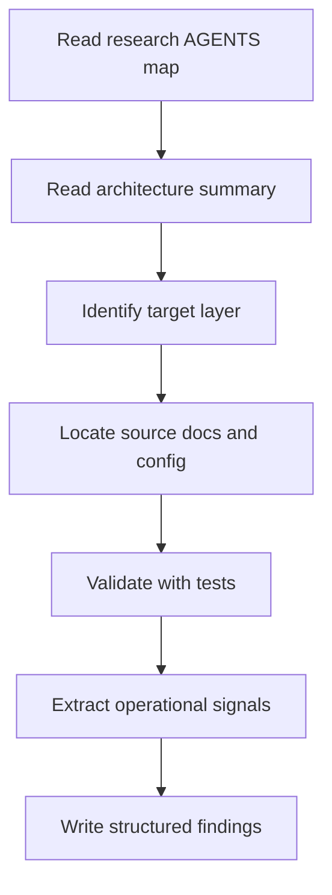

# Agent-First Operating Model for Studying APISIX

## 운영 모델 요약

APISIX 연구를 agent-first 방식으로 수행할 때는 아래 순서를 따른다.

## 대상 레이어 예시

- bootstrap and runtime
- routing and matching
- plugin orchestration
- deployment and config
- testing and CI
- observability
- AI Gateway and MCP surface

## 작업 규율

- 먼저 맵을 읽고, 그 다음 구현을 읽는다.
- 공식 문서와 테스트가 충돌하면 테스트를 우선 검토 대상으로 둔다.
- 설정 예제는 운영 현실을 반영하는 1차 자료로 취급한다.
- 변경 제안은 별도 단계로 분리하고, 연구 문서에는 사실과 해석을 구분한다.

